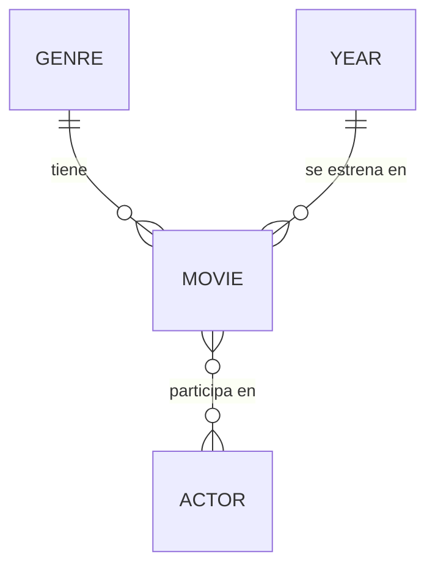
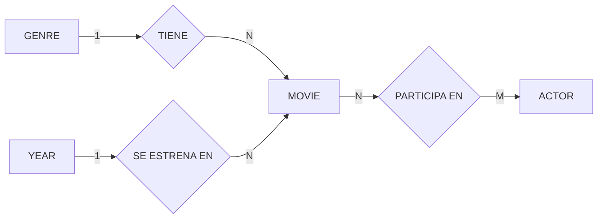
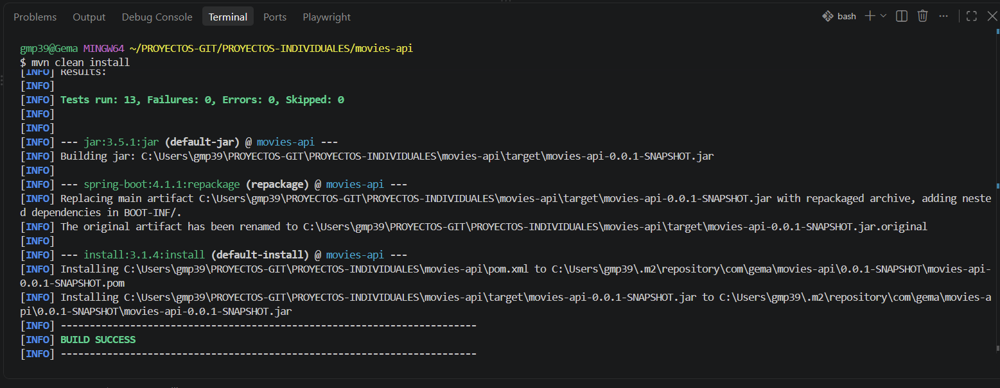

# Movies API

API REST para la gestión de películas, géneros, años y actores, desarrollada con Spring Boot y Java.

## Índice

- [Descripción](#descripción)
- [Tecnologías](#tecnologías)
- [Modelo de datos](#modelo-de-datos)
- [Endpoints](#endpoints)
- [Instalación](#instalación)
- [Testing](#testing)
- [Autora](#autora)

## Descripción

API REST desarrollada como proyecto individual del bootcamp, que permite gestionar una colección de películas con sus relaciones a género, año de estreno y actores.

La API expone 6 endpoints: los 5 CRUD básicos (obtener todas, obtener por id, crear, actualizar y eliminar) más un endpoint adicional de búsqueda por título o género.

**Nota sobre la base de datos:** el proyecto se desarrolló inicialmente con H2 (base de datos en memoria) para agilizar el desarrollo y las pruebas iniciales sin dependencias externas. Una vez validado el funcionamiento completo del CRUD, se migró a MySQL, levantado mediante Docker Compose, para tener persistencia real de los datos.

## Tecnologías

- Java 21
- Spring Boot 4.1.1
- Spring Data JPA / Hibernate
- MySQL (vía Docker Compose)
- Maven
- JUnit 5 + Mockito (testing)
- Postman (pruebas manuales de endpoints)

## Modelo de datos

**Relaciones:**
- Movie – Genre: 1:N
- Movie – Year: 1:N
- Movie – Actor: N:M (tabla intermedia `movie_actor`)

### Diagrama de patas de gallo (crow's foot)



### Diagrama de Chen



## Endpoints

| Método | Ruta | Descripción |
|---|---|---|
| GET | `/api/movies` | Obtener todas las películas |
| GET | `/api/movies/{id}` | Obtener una película por id |
| POST | `/api/movies` | Crear una película |
| PUT | `/api/movies/{id}` | Actualizar una película |
| DELETE | `/api/movies/{id}` | Eliminar una película |
| GET | `/api/movies/search?title=...` o `?genre=...` | Buscar por título o género |

También disponibles los CRUD equivalentes para `/api/genres`, `/api/years` y `/api/actors`.

## Instalación

1. Clona el repositorio:
```bash
   git clone https://github.com/gmp395/movies-api.git
```
2. Levanta el contenedor de MySQL con Docker Compose (Spring Boot lo hace automáticamente al arrancar, siempre que Docker Desktop esté abierto):
```bash
   docker compose up -d
```
3. Ejecuta la aplicación:
```bash
   mvn spring-boot:run
```
4. La API estará disponible en `http://localhost:8081`.

## Testing

Se han realizado dos tipos de pruebas:

- **Pruebas manuales de integración** con Postman, verificando cada endpoint (incluidas las relaciones entre entidades) contra la base de datos MySQL real.
- **Tests unitarios** con JUnit 5 y Mockito para la capa de Service de las 4 entidades, simulando los repositorios para probar la lógica de negocio de forma aislada.



## Autora

**Gema Miguel**
[GitHub](https://github.com/gmp395)